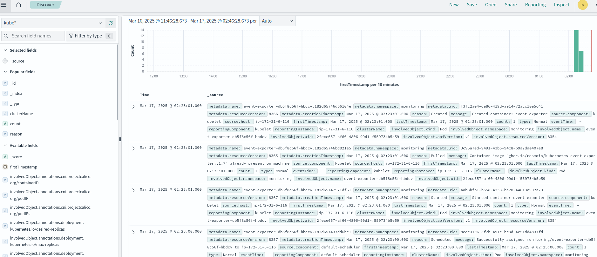
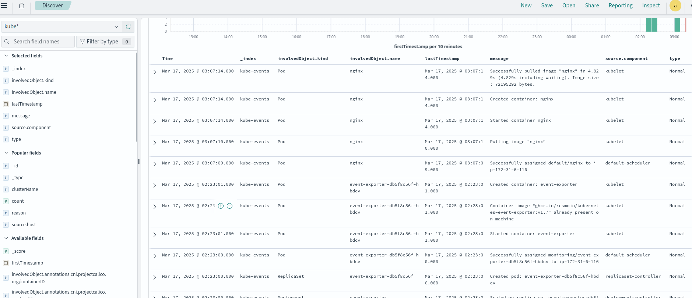

## Export kubernetes events to Opensearch, and browse it using Opensearch-dashboard

## Steps

1. Provision a kubernetes cluster on AWS, I test it with kubeadm provisioned cluster (one master and one worker node)
2. Spin up one linux vm to install opensearch and opensearch-dashboard
3. Install opensearch and opensearch-dashboard using shell scripts
4. Go to master node and copy deploy folder here (this deploy folder from https://github.com/resmoio/kubernetes-event-exporter)
5. Change 01-config.yaml file (Opensearch server IP and its user passwords)
6. Create a monitoring namespace
7. Deploy manifest files with "kubectl apply -f ."
8. In addition run a any pod to create more events

## ---------------------------------------------------------

### After installation openseach and opensearch-dashboard, use below commands to verify everything is good
Replace my-pass with your real password

### use below command at opensearch server and master node
curl -X GET https://IP:9200 -u 'admin:my-pass' --insecure

### check if there is kube-event indices
curl -k -u admin:my-pass https://IP:9200/_cat/indices --insecure

### check how many indices send to opensearch
curl -k -u admin:my-pass https://IP:9200/kubernetes-events-*/_count --insecure

### Screenshots

